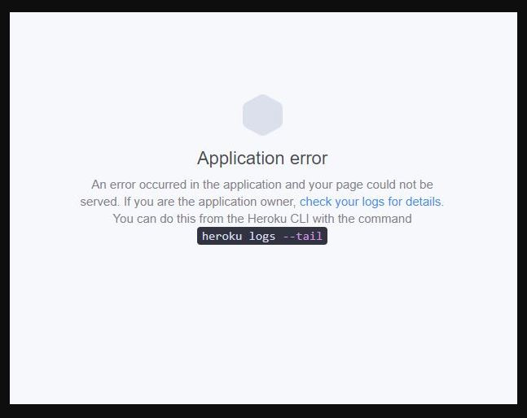

# EAT DA BURGER

# Description 
This is an appilcation allows the user will select what type of burger/sandwich they want to eat, and then have a button that said, "EAT!" This application was made with MySQL, Node, Express, Handlebars and ORM.

##### Click to Watch Video of EAT DA BURGER
https://drive.google.com/file/d/1os074_mTLzwDPmHxXPdDlS5BOY_wG_Bl/view 

##### Click to View Website lauched in Heroku
https://burgerlogger12.herokuapp.com/

# Problems
I ran into problems again, and I had the same issues as I did with Employee Tracker assingment. I google the error that kept popping up, and I try to fix it. Then I would rerun the project, and the errors still come up, or new error would arise. I have add pictures below of the errors that pop up. 

Also Heroku is a pain to work with, I could not get it to delopy, but I will continue to work on it, and I also added pictures of the error that popped up. 

# Solution
After looking over my code and checking for errors; I relize that I wrote the code incorrectly and that I missed spelled a word or two, and that I was using the incorrect localhost, but after I fixed everything I was able to get the application to work. 

# Pictures
### What the Project looks like

### Errors that occured

### Heroku Error

##### Redeployed to Heroku and it said it was successful 

##### Error Still occured 

##### I dont understand why my heroku will not display the website, and I ran the log to see if there are any errors it looks like there isn't. 

